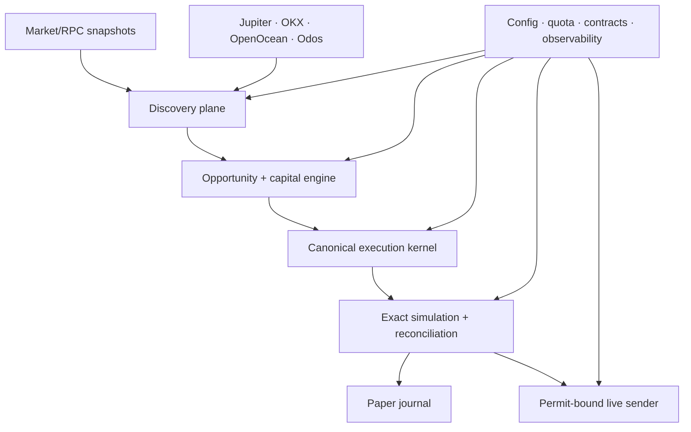

# Аудит production readiness и новая PR-дорожная карта flash-loan arbitrage bot

**Дата аудита:** 19 июля 2026
**Проверенный снимок:** `studious-pancake-main (4)(1).zip`
**SHA-256 архива:** `b8da0e77f906862f9f14ee43f010a5b1f1071311ecf210cf2a1d6bdcc8952ebd`
**Назначение документа:** автономный контекст для продолжения работы в новом чате и последующего составления отдельного Codex-ready промпта для каждого PR.

> Важное ограничение: этот документ описывает состояние именно указанного снимка. Номера PR-001…PR-022 сами по себе не считаются доказательством готовности функций. Новая очередь начинается с PR-023 и опирается на фактически присутствующий и запускаемый код.

---

## 1. Итог аудита

**Текущий статус: RED — репозиторий не production-ready и пока не является работоспособным end-to-end арбитражным ботом.**

При этом в репозитории уже есть полезные заготовки: доменные модели, safety-gates, часть Jupiter router, transaction compiler на Solders, режимы стратегий, permit-модель, journal/store, тестовая база и документация по некоторым внешним контрактам. Их разумно сохранить и довести, а не переписывать всё с нуля.

Главные блокеры:

1. Основной `arb_bot.py` запускает сервис, но стратегии фактически ничего не обнаруживают, а найденные возможности попадают в `ShadowOnlyOpportunityHandler`. Реальный planner/compiler/simulator/sender в активный runtime не собран.
2. `scripts/paper_trader.py` не является полноценным paper execution kernel и падает на первой итерации из-за передачи `float` в `Lamports.from_sol`; далее присутствует обращение к неопределённому `sol_price`.
3. MarginFi-интеграция не может корректно читать mainnet-аккаунты: текущий parser ожидает JSON после discriminator, хотя реальные Anchor/Solana accounts бинарные. Тесты подтверждают синтетический JSON-формат, а не официальный IDL/SDK layout.
4. Исполнение раздвоено между каноническими моделями Solders и legacy-совместимостью с синтетическим `b"unsigned:"`. Это делает message hash, симуляцию и reconciliation неоднозначными.
5. Shadow reconciliation не доказывает возврат flash loan по состоянию аккаунтов: наличие слова `repay` в логах принимается за подтверждение возврата; SPL/Token-2022 балансы фактически не вычисляются.
6. В коде есть неверные Program IDs, включая Token-2022 и Associated Token Account constants. Часть Pump/Phoenix/OpenBook/Kamino manifests — fixture-заглушки с placeholder hash/program ID.
7. Четыре route-provider адаптера не образуют production routing plane: есть несколько независимых Jupiter-клиентов с разными лимитерами, остальные провайдеры в основном нормализуют ответы, но не имеют единой transport/quota/health/orchestration реализации.
8. Live mode намеренно заблокирован, а сигнатуры lifecycle sender и permit-bound sender несовместимы. Это правильнее, чем небезопасный запуск, но live нельзя включать до завершения всей вертикали.
9. CI выглядит зелёным, однако текущие настройки игнорируют `F821`; в снимке обнаружено 35 обращений к неопределённым именам. Online MarginFi opt-in test при наличии переменных окружения не выполняет никаких assertions.
10. Docker healthcheck проверяет `localhost:3000/health`, но основной launcher не поднимает такой endpoint.
11. README завышает зрелость: заявляет real-time bot, full paper simulation, Jito execution и «free flash loans», хотя активная вертикаль этого не подтверждает.
12. Production telemetry, durable runtime journal, key isolation, dependency scanning, recovery и operational drills не встроены в основной процесс.

**Правильная ближайшая цель:** не «включить live», а получить один доказуемый вертикальный сценарий:

`котировки → opportunity → capital-aware sizing → MarginFi/Jupiter atomic plan → v0 message → симуляция точно этого message → экономическая сверка → durable paper outcome`.

Только после длительного shadow soak и выполнения release gates допускается ограниченный live-canary.

---

## 2. Контекст продукта и принятые ограничения

Этот roadmap учитывает следующие продуктовые решения:

- приблизительный собственный баланс — **0,015 SOL**;
- сначала **paper/shadow**, затем ограниченный live;
- нужны четыре источника цен/маршрутов, но бесплатный Jupiter quota ограничен;
- актуальный источник MarginFi/Project Zero — [`0dotxyz/marginfi-v2`](https://github.com/0dotxyz/marginfi-v2), а конкретный deployment/IDL должен быть подтверждён через RPC и pinned artifacts;
- AI может быть только advisory/offline intelligence и не вправе менять live safety rules, размер сделки, permit или kill switch;
- Pump, Phoenix/OpenBook, Kamino/liquidation остаются `disabled` или `shadow`, пока каждый протокол отдельно не пройдёт conformance;
- все стратегии обязаны пользоваться одним execution kernel;
- корректный результат capital engine может быть **«не торговать»**, даже если найден gross spread.

---

## 3. Что именно проверено

### 3.1 Состав снимка

- 324 безопасных элемента в ZIP;
- 264 файла после распаковки;
- около 42 981 строк Python;
- крупные legacy-модули всё ещё находятся в активном дереве, включая `src/legacy_arb_bot.py` и `src/ingest/tx_builder.py`.

### 3.2 Воспроизводимый baseline

В чистом virtualenv выполнен `scripts/verify_repo.py`:

- `pip check` — успешно;
- compile — успешно;
- 49 import-smoke проверок — успешно;
- 312 тестов — успешно;
- 1 тест — skipped.

Этот результат полезен, но не доказывает готовность к production:

- `tests/providers/test_marginfi_readonly_optin.py` при включённом окружении не делает содержательных assertions;
- `.flake8` игнорирует `F821`, поэтому undefined names не ломают CI;
- отдельный анализ нашёл 35 undefined-name ошибок, из них 18 вне `legacy_arb_bot.py`;
- Black сообщает, что 188 файлов требуют форматирования;
- Bandit вне legacy-кода нашёл 6 medium и 76 low issues;
- нет обязательных type-check, dependency vulnerability scan, SBOM и end-to-end launcher smoke.

### 3.3 Реальный запуск

Запуск `arb_bot.py` под timeout не привёл ни к обнаружению opportunities, ни к paper execution. Причина не во внешнем рынке:

- конфигурация launcher не загружается из единой production schema;
- базовый `detect_once()` возвращает пустой tuple;
- LST/circular/Pump/Kamino/orderbook реализации являются пустыми, disabled или fixture-only;
- ranker — `ArbitrageScorerRanker`;
- handler — `ShadowOnlyOpportunityHandler`;
- `Application` отвергает `StrategyMode.LIVE`;
- execution services рядом существуют, но в runtime graph не подключены.

### 3.4 Paper mode

`scripts/paper_trader.py` — отдельная legacy-ветвь:

- использует собственный Jupiter endpoint и собственный limiter;
- оперирует `float`;
- не использует канонический planner/compiler/simulator;
- simulator оставлен `None`;
- баланс и trade accounting отключены через `if False`;
- quote считается результатом без доказательства исполнимости;
- smoke-вызов воспроизвёл `MonetaryUnitError: sol cannot be a binary float`.

Следовательно, README-формулировка «full simulation» сейчас неверна.

### 3.5 Карта доказательств в репозитории

| Путь / символ | Что обнаружено | К каким PR относится |
|---|---|---|
| `arb_bot.py`, `load_configuration()` | Launcher использует defaults, стратегии выключены, composition root не строит execution pipeline | PR-023, PR-025, PR-026, PR-038 |
| `src/application.py` | `ShadowOnlyOpportunityHandler`; `LIVE` отвергается; execution services не подключены | PR-023, PR-033, PR-038, PR-046 |
| `src/strategy/strategies.py` | Базовый detector, LST/circular/Pump возвращают пустые результаты; Kamino/orderbook — shells | PR-033, PR-048…PR-050 |
| `scripts/paper_trader.py` | Отдельный Jupiter client, float money, `simulator=None`, disabled accounting, runtime crash | PR-024, PR-029, PR-038 |
| `src/execution/models.py` | Typed Solders domain смешан с legacy positional shim | PR-029 |
| `src/execution/transaction_compiler.py` | Реальный v0 compiler сосуществует с synthetic `b"unsigned:"` path | PR-029, PR-035 |
| `src/execution/shadow.py` | Второй report type, synthetic serialization/hash и log-based repayment heuristic | PR-029, PR-036, PR-037 |
| `src/execution/transaction_simulator.py` | Account collection может быть чрезмерной; token deltas представлены только native lamports | PR-036, PR-037 |
| `src/providers/marginfi/accounts.py` | После discriminator ожидается UTF-8 JSON, а не бинарный Anchor layout | PR-027, PR-028 |
| `src/providers/marginfi/provider.py` | Fee предполагается нулевой; account mutability захардкожена | PR-028, PR-032, PR-034 |
| `docs/contracts/marginfi_mainnet.json` | Placeholder SHA, неподтверждённые IDL/SDK metadata и недостаточно deployed account provenance | PR-027, PR-028 |
| `tests/providers/test_marginfi_provider.py` | Synthetic JSON bytes названы conformance fixture | PR-024, PR-027, PR-028 |
| `tests/providers/test_marginfi_readonly_optin.py` | Opt-in test не содержит полезных assertions | PR-024, PR-027, PR-028 |
| `src/providers/jupiter/router.py` | Наиболее подходящий canonical router, но не встроен в active runtime | PR-030, PR-031, PR-034 |
| `src/routing/adapters.py` и legacy/paper clients | Дублирующий Jupiter adapter/limiter; остальные providers в основном normalization-only | PR-030, PR-031 |
| `src/execution/live_gate.py` | Gate всегда deny — безопасно для текущего состояния | PR-045, PR-046 |
| lifecycle service / `PermitBoundSender` | Несовместимые `submit` signatures и незавершённый status reconciliation | PR-029, PR-041, PR-045 |
| `src/domain/money.py`, `src/venues/pump/adapter.py` | Неверные Token-2022/ATA constants | PR-026, PR-048 |
| `docs/registry/orderbook_venues.json` | Fake program IDs, placeholder SHA и magic layouts | PR-023, PR-027, PR-049 |
| `src/observability/*` | Полезные stores есть, но active runtime их не использует | PR-041, PR-042 |
| `Dockerfile` | Healthcheck ждёт HTTP endpoint, которого launcher не поднимает | PR-025, PR-042 |
| `.flake8` / CI | `F821` маскируется; security/type/package gates неполны | PR-024, PR-025, PR-043 |

---

## 4. Матрица ключевых проблем

| Приоритет | Область | Фактическая проблема | Риск | Нужное исправление |
|---|---|---|---|---|
| P0 | Runtime | Нет связанной end-to-end вертикали | Бот ничего не делает | Один composition root и один execution kernel |
| P0 | MarginFi | JSON parser вместо бинарного layout | Неверные balances/metas, невозможность mainnet | Pinned IDL/SDK fixtures, бинарный decoder, RPC conformance |
| P0 | Paper | Script падает и не симулирует transaction | Ложная уверенность | Заменить production shadow-runner |
| P0 | Simulation | Симулируется не гарантированно финальное message | Profit/repayment могут относиться к другой транзакции | Message-hash invariant и final exact simulation |
| P0 | Reconciliation | `repay` в логах считается proof | Возможен долг/убыток при «успехе» | Проверять account/token deltas и protocol state |
| P0 | Economics | Нет общего capital/reservation engine | Недостаток SOL на fee/rent/tip, oversubscription | Integer sizing и atomic reservations |
| P0 | Constants | Неверные Token-2022/ATA/program IDs | Неправильные инструкции или аварийный отказ | Канонический registry + startup attestation |
| P1 | Routing | 3+ Jupiter clients и раздельные лимитеры | Бесплатный quota исчерпывается несогласованно | Один account-wide quota manager |
| P1 | Providers | OKX/OpenOcean/Odos не готовы к atomic execution | Quote ошибочно считается executable | Discovery/execution capabilities и conformance gates |
| P1 | Execution models | Legacy positional model и fake compiler | Несовместимые типы/hash | Удалить active legacy path |
| P1 | Jito | Неверная модель auth/URL/status | Двойной path, ложный accepted | Issued UUID, normalized URL, status polling |
| P1 | CI | Undefined names маскируются | Зелёный CI при runtime failure | Fail-on-F821 и реальный entrypoint test |
| P1 | State | In-memory sink/tracker в runtime | Потеря статуса после crash | Durable journal, idempotency, recovery |
| P1 | Observability | Store/metrics не подключены | Нет operational visibility | Metrics/health/readiness/SLO |
| P1 | Security | Ключи/секреты и supply-chain не hardened | Компрометация wallet/runtime | Isolated signer, secret refs, SBOM/scans |
| P2 | Pump/orderbook/lending | Fixture-заглушки выглядят как интеграции | Случайное включение невалидного кода | Явный quarantine и отдельное promotion |
| P2 | AI | Возможен scope creep к live control | Недетерминированные решения | Advisory-only boundary и audit trail |
| P2 | Docs | README и manifests не отражают runtime truth | Ошибочные действия операторов | Executable docs и drift checks |

---

## 5. Совместимость с внешними контрактами

Все внешние утверждения ниже проверялись по первичным источникам на дату аудита. Перед реализацией конкретного PR Codex должен повторно проверить pin/version, потому что API и on-chain programs меняются.

### 5.1 Solana transaction/RPC

Официальная документация задаёт несколько обязательных инвариантов:

- `simulateTransaction` не отправляет транзакцию в сеть и должен получать корректно сериализованную транзакцию; [Solana `simulateTransaction`](https://solana.com/docs/rpc/http/simulatetransaction).
- Реальную network fee для конкретного serialized message следует получать через [`getFeeForMessage`](https://solana.com/docs/rpc/http/getfeeformessage).
- `sendTransaction` возвращает signature, но это ещё не доказательство обработки; preflight/commitment должны быть согласованы; [Solana `sendTransaction`](https://solana.com/docs/rpc/http/sendtransaction).
- Размер serialized transaction ограничен 1232 bytes, а recent blockhash имеет ограниченный срок жизни; [Solana transactions](https://solana.com/docs/core/transactions).
- WebSocket account updates имеют context/slot, которые необходимо сохранять и проверять; [`accountSubscribe`](https://solana.com/docs/rpc/websocket/accountsubscribe).

В репозитории часть v0/Solders compile path существует, но она смешана с fake legacy serialization, а account/token deltas и final-message identity не доказаны.

### 5.2 Jupiter

Текущий официальный composable flow использует Swap V2 `/build`, возвращающий raw instructions, account metas, lookup table addresses и blockhash metadata. Документация рекомендует сначала симулировать с высоким CU limit, затем взять примерно 1,2× consumed units с верхним ограничением; [Jupiter Build](https://developers.jup.ag/docs/swap/build).

Аудит:

- `src/providers/jupiter/router.py` ближе всего к правильной границе;
- параллельно существуют `src/routing/adapters.py`, paper client и ingest clients с независимыми limiters;
- router не подключён к active strategy-to-execution runtime;
- официальный account quota нельзя заменять предположением «60 запросов/60 секунд для всех»: quota должен быть конфигурируемым и адаптироваться к реальным `429`/headers/account plan;
- unknown schema должен fail closed, но нужна процедура обновления pinned fixtures;
- `maxAccounts` и DEX filters — параметры конкретной попытки, а не универсальные константы для каждой сделки.

**Решение:** единый safety envelope плюс несколько bounded attempt profiles. Один фиксированный Jupiter config для всех сделок хуже, потому что размер ALT/account set и ликвидность маршрута зависят от пары и состояния сети. Но attempts не должны быть бесконечными или хаотичными.

### 5.3 MarginFi / Project Zero

Единственный допустимый источник истины для этой интеграции — актуальный [`0dotxyz/marginfi-v2`](https://github.com/0dotxyz/marginfi-v2) и его [releases](https://github.com/0dotxyz/marginfi-v2/releases), дополненные проверкой deployed program/accounts через RPC.

Проблемы снимка:

- manifest содержит placeholder `idl_sha256`;
- IDL path и SDK identity не подтверждают текущий deployment;
- parser декодирует JSON после discriminator вместо реального бинарного layout;
- tests используют такой же синтетический JSON и потому подтверждают только сам fixture;
- writable/read-only metas захардкожены и могут не соответствовать текущей инструкции;
- fee считается нулевой без чтения protocol state;
- текущие release notes содержат изменения состава accounts для flashloan/liquidation и требований borrow/repay, поэтому metas нельзя переносить из старого SDK;
- вопрос configurable fee уже обсуждался в upstream; [MarginFi issue #270](https://github.com/0dotxyz/marginfi-v2/issues/270). Production-код обязан читать/доказывать fee, а не предполагать ноль.

**Решение:** pin commit/release + deployed program identity + SHA реального IDL; генерировать/проверять layout и instruction metas из этого pin; хранить официальные golden bytes; иметь opt-in mainnet read-only conformance test с реальными assertions.

### 5.4 Jito Block Engine

Официальный API различает single transaction и bundles. Bundle содержит не более пяти транзакций, выполняется последовательно и атомарно в одном slot; минимальный bundle tip — 1000 lamports; авторизация — выданный Jito UUID через `x-jito-auth` или query parameter; успешный JSON-RPC response ещё не означает landed bundle, поэтому нужен `getBundleStatuses`. См. [Jito Low Latency Transaction Send](https://docs.jito.wtf/lowlatencytxnsend/).

Проблемы снимка:

- setup генерирует случайный hex `JITO_AUTH_KEY` — это не выданный Jito UUID;
- `JITO_RPC_URL` может уже содержать `/api/v1/bundles`, а sender добавляет тот же path;
- sender способен пометить запрос accepted при отсутствующем/ошибочном result;
- lifecycle sender и permit-bound sender имеют несовместимые сигнатуры;
- нет полноценного landed/failed/expired reconciliation.

**Решение:** нормализованный base URL, typed auth secret, canonical submission receipt, status state machine и ровно один tip policy.

### 5.5 OKX

[OKX Solana Swap Instruction API](https://web3.okx.com/onchainos/dev-docs/trade/dex-solana-swap-instruction) использует authenticated API, `chainIndex=501` и может возвращать instruction/account/ALT данные; параметры и schema меняются, что отражено в официальном [changelog](https://web3.okx.com/onchainos/dev-docs/home/change-log).

Текущий adapter умеет нормализовать часть полей, но не реализует полноценный transport, ALT provenance, quota и composed-simulation contract. До отдельного conformance gate OKX следует использовать только для discovery/benchmark. Позже его можно допустить к atomic planning, если из ответа можно детерминированно собрать тот же flash-loan message и доказать его в симуляции.

### 5.6 OpenOcean

Официальный [OpenOcean Solana Swap API](https://docs.openocean.finance/docs/solana-swap-api) требует API key и указывает небольшой default rate limit; он агрегирует в том числе Jupiter/Titan. Общая модель доступа и fees описана отдельно в [API Pricing and Access](https://docs.openocean.finance/docs/swap-api/api-pricing-and-access).

Следствия:

- это полезный дополнительный источник discovery, но не независимое подтверждение ликвидности Jupiter;
- response costs/fees надо нормализовать явно;
- без key provider должен быть `disabled`, а не постоянно ретраиться;
- до instruction conformance он не участвует в atomic flash-loan execution.

### 5.7 Odos

[Odos Solana API](https://docs.odos.xyz/api/solana) предоставляет quote/assemble flow. Официальный [assemble contract](https://docs.odos.xyz/api/solana/assemble) предупреждает, что assembled transaction следует использовать без модификаций.

Следовательно, Odos полезен для discovery/benchmark, но его assembled transaction нельзя безопасно вставить между MarginFi flashloan instructions. Он не считается execution-capable provider для первой atomic вертикали.

### 5.8 Token programs и advanced venues

Официальный Token-2022 Program ID: `TokenzQdBNbLqP5VEhdkAS6EPFLC1PHnBqCXEpPxuEb`; официальный Associated Token Program ID: `ATokenGPvbdGVxr1b2hvZbsiqW5xWH25efTNsLJA8knL`; источник — [Solana Token-2022 repository](https://github.com/solana-program/token-2022). В снимке встречаются другие строки, включая неверный, но syntactically valid pubkey, и invalid Pump constants. Оба адреса должны находиться в едином registry и проверяться как `Pubkey` при старте.

Для Pump единственным допустимым источником является [pump-public-docs](https://github.com/pump-fun/pump-public-docs). Текущий код вычисляет discriminator из собственной строки version/name, содержит придуманный binary layout и placeholder hashes — это нельзя повышать выше `disabled`.

Phoenix/OpenBook/Kamino/liquidation manifests в снимке остаются fixture-only/unverified. Их нельзя включать одним общим «enable venues» PR: каждый протокол требует отдельного pin, IDL/layout fixtures, RPC conformance, economic reconciliation и shadow soak.

---

## 6. Целевая архитектура

### Обязательные архитектурные границы

1. **Discovery provider** сообщает цену/маршрут и provenance.
2. **Execution-capable provider** дополнительно обязан отдать проверяемые instructions/ALTs, которые можно встроить в atomic flash-loan message.
3. **Opportunity engine** не знает секретов и не отправляет транзакции.
4. **Capital engine** резервирует собственный SOL и отклоняет экономически/операционно невозможные candidates.
5. **Planner** создаёт один typed `TransactionPlan`.
6. **Compiler** создаёт один canonical v0 message и message hash.
7. **Simulator** симулирует именно этот message.
8. Изменение CU price/limit, blockhash, ALT или instruction после симуляции инвалидирует proof и требует новой финальной симуляции.
9. **Reconciler** доказывает repayment и net outcome по состоянию accounts/tokens, а не только по логам.
10. Paper и live используют одинаковые стадии 1–9; отличаются только последним sink/sender.
11. Live sender принимает только подписанный permit на конкретный message hash.
12. Advanced venue не может обойти общий kernel.

---

## 7. Правильная стратегия четырёх route providers

### 7.1 Не делать все четыре равноправными executors

На первом production-safe этапе:

| Provider | Discovery | Atomic execution | Причина |
|---|---:|---:|---|
| Jupiter | Да | **Да, первый и единственный** | Официальный `/build` отдаёт composable instructions и ALTs |
| OKX | Да | Нет до conformance | Потенциально возможно, но transport/schema/ALT ещё не доказаны |
| OpenOcean | Да | Нет | Meta-aggregator, correlated с Jupiter, instruction contract не встроен |
| Odos | Да | Нет | Assembled transaction по контракту нельзя модифицировать |

Четыре источника повышают обзор рынка, но не создают четыре независимых пула ликвидности. Routing должен сохранять `provider`, `underlying sources`, timestamp/slot, request parameters, quote ID, fees и confidence, чтобы не принимать correlated quotes за независимое подтверждение.

### 7.2 Jupiter quota на бесплатном тарифе

Нужен один process/account-wide `QuotaManager` для всех вызовов: discovery, route refinement, build и re-quote. Отдельные лимитеры в paper/router/ingest должны быть удалены.

Рекомендуемое бюджетирование:

- зарезервировать часть quota для финального re-quote/build;
- не опрашивать Jupiter повторно, если snapshot ещё fresh и edge ниже порога;
- selectively запрашивать остальные providers при предварительном edge, stale route или необходимости cross-check;
- учитывать `429` и `Retry-After`, exponential backoff с jitter и circuit breaker;
- ограничивать attempts по quote age, remaining quota, deadline и ухудшению net profit;
- не считать undocumented fixed RPS универсальной истиной: стартовый budget задаётся config, затем корректируется telemetry.

### 7.3 Универсальные настройки против route attempts

Правильный вариант — **универсальный safety envelope + конечный набор профилей попыток**.

Неизменяемый envelope:

- allowlisted mints/programs;
- maximum slippage и price impact;
- v0 transaction;
- максимум transaction bytes/CU/accounts;
- запрещённые DEX/programs;
- freshness/slot/commitment;
- обязательные fee/rent/tip/repayment buffers;
- minimum net profit и confidence;
- deadline и quota ceiling.

Внутри envelope допустимы bounded attempts, например:

1. default route с максимально разрешённым account budget;
2. немного уменьшенный account budget, если flash-loan accounts/ALT не помещаются;
3. evidence-driven include/exclude DEX profile;
4. отказ от сделки, а не дальнейший перебор.

Конкретные значения `maxAccounts` должны быть конфигурацией и проверяться на реальных compiled bytes. Они не должны быть одной константой «для любых сделок».

---

## 8. Capital-aware decision model для 0,015 SOL

Собственный SOL и flash-loan principal — разные ресурсы.

### 8.1 Что оплачивается собственным балансом

Минимум:

- base transaction fee;
- priority fee;
- Jito tip, если выбран bundle path;
- возможное создание ATA/wSOL accounts и rent;
- временно заблокированный rent;
- запас на повторную отправку/операционный сбой;
- safety reserve, который запрещено расходовать.

Flash loan не оплачивает эти расходы автоматически. Поэтому 0,015 SOL нельзя целиком считать доступным trading capital.

### 8.2 Формула допустимости

Все величины хранятся integer units: lamports/token atoms, без binary float.

`available_native = wallet_lamports - protected_reserve - active_reservations`

Candidate допускается только если:

`available_native >= worst_case_fee + priority_fee + tip + peak_rent + contingency`

и

`conservative_net_profit = guaranteed_min_out - flash_repayment - all_fees - rent_loss - slippage_buffer - uncertainty_buffer > configured_min_profit`

Размер flash loan выбирается по bounded grid/поиску на проверяемых quote functions, но ограничивается:

- protocol/bank liquidity;
- price impact;
- route account/byte/CU limits;
- quote freshness;
- wallet operational reserve;
- concurrency reservations;
- policy cap для paper/canary.

Если ни один размер не проходит — результат `NO_TRADE`. Это обязательное безопасное поведение.

### 8.3 Reservation lifecycle

`proposed → reserved → compiled → simulated → permitted → submitted → settled/expired`

Резерв должен освобождаться idempotently при любом terminal state. Одновременные candidates не могут каждый видеть один и тот же свободный баланс.

---

# 9. Новая PR-дорожная карта

## Правила для всей очереди

Каждый PR:

- решает одну ограниченную тему и остаётся revertable;
- сначала инспектирует актуальный код, а не исходит из названия старого PR;
- использует только официальные внешние источники;
- добавляет unit/contract/integration/negative tests пропорционально риску;
- не включает live автоматически;
- обновляет `docs/external_contracts.yaml`, README и config schema, если меняется внешний контракт;
- не добавляет compatibility shim в active path без срока удаления;
- не использует `float` для денег;
- сохраняет deterministic provenance: version, endpoint, schema, slot, hashes;
- оставляет advanced providers `disabled` до своего promotion gate.

---

## Phase A — сделать репозиторий честным и воспроизводимым

### PR-023 — Runtime truth, quarantine и честный product contract

**Цель:** зафиксировать, что реально запускается, и не позволять fixture/legacy коду выглядеть production-capable.

**Scope:**

- создать machine-readable capability matrix: `implemented / fixture-only / shadow-ready / live-ready / disabled`;
- пометить legacy и advanced venue modules как quarantine;
- исправить README, quickstart, feature table и заявления о paper/live/flash-loan fees;
- добавить команду `status/capabilities`;
- документировать один поддерживаемый entrypoint и режимы `disabled/paper/shadow/live`;
- сохранить этот аудит в `docs/audits/` или дать ссылку на его immutable snapshot.

**Acceptance:**

- README не обещает execution, которого нет;
- default startup явно сообщает `no executable strategies` и завершается с диагностируемым кодом либо запускает заявленный shadow pipeline;
- fixture-only module невозможно включить только env-флагом;
- capability matrix проверяется тестом против registry.

**Зависимости:** нет.
**Не входит:** реализация торговой вертикали.

---

### PR-024 — CI quality gates, которые не маскируют runtime defects

**Цель:** зелёный CI должен означать отсутствие известных статических и launcher ошибок.

**Scope:**

- убрать игнорирование `F821` и исправить все undefined names;
- выбрать один lint stack, например Ruff + Black, и исключить legacy только через явный quarantine;
- добавить type-check для production packages;
- включить Bandit с baseline/triage, dependency audit и secret scan;
- заменить пустой MarginFi opt-in test содержательным или удалить ложный тест;
- добавить `arb_bot.py` startup smoke с timeout и ожидаемой readiness;
- сделать `scripts/verify_repo.py` единым локальным аналогом CI.

**Acceptance:**

- текущие 35 undefined names устранены либо файл исключён как неимпортируемый quarantine;
- lint/format/type/security checks обязательны;
- intentional skip содержит reason и не считается online conformance pass;
- чистая установка и verify проходят на CI Python.

**Зависимости:** PR-023.

---

### PR-025 — Packaging, dependency boundaries и рабочий container

**Цель:** один воспроизводимый runtime вместо смеси scripts и тяжёлого research environment.

**Scope:**

- ввести `pyproject.toml`, console entrypoint и явную supported Python version;
- согласовать Docker/CI/lock generator;
- разделить core runtime, dev/test и analytics/ML extras;
- перестроить multi-stage, non-root container;
- либо поднять реальный `/health`/`/ready` endpoint, либо заменить Docker healthcheck на корректную process check до PR-042;
- добавить deterministic lock update procedure и image smoke.

**Acceptance:**

- clean install не зависит от writable root cache;
- container стартует заявленный entrypoint и становится healthy;
- runtime image не содержит ненужный ML toolchain;
- `pip check` и import smoke проходят внутри image.

**Зависимости:** PR-024.

---

### PR-026 — Единая typed configuration, secrets и chain constants registry

**Цель:** удалить конкурирующие env/YAML/module defaults и неверные адреса.

**Scope:**

- одна typed schema для modes, RPC, Jupiter, providers, wallet, limits, fees и observability;
- строгая precedence-модель file/env/CLI;
- integer monetary values;
- canonical registry для System, Token, Token-2022, ATA, MarginFi и разрешённых programs/mints;
- заменить неверные Token-2022/ATA constants;
- startup validation всех pubkeys, cluster и account owners;
- Jito auth только как выданный UUID/secret reference; не генерировать fake key;
- redacted config dump и `config doctor`.

**Acceptance:**

- invalid/foreign-cluster address останавливает startup;
- secret не выводится в logs/exceptions;
- нет production defaults с current-looking bank/wallet addresses;
- все active modules получают один immutable config object;
- тесты ловят известные неверные constants из снимка.

**Зависимости:** PR-023, PR-025.

---

### PR-027 — Registry внешних контрактов, pinned fixtures и drift detection

**Цель:** любой API/IDL/layout должен иметь доказуемое происхождение.

**Scope:**

- schema registry: provider, official source URL, commit/release, artifact path, SHA-256, fetched_at, deployment/program ID, cluster;
- updater/validator для Jupiter schemas, MarginFi IDL/fixtures, Jito/OKX/OpenOcean/Odos response fixtures;
- запрет placeholder hashes в active entries;
- offline golden tests + opt-in read-only RPC/API conformance;
- drift report, который fail closed для execution capability;
- процесс ручного review/rotation pins.

**Acceptance:**

- каждый active external contract имеет реальный hash;
- изменённый fixture/schema детектируется;
- online test делает assertions и сохраняет redacted provenance;
- отсутствие сети не превращает skipped test в «verified».

**Зависимости:** PR-024, PR-026.

---

## Phase B — протоколы, модели и smart discovery

### PR-028 — MarginFi/Project Zero: реальный IDL, binary decoding и instruction conformance

**Цель:** получить доказуемую основу flash-loan provider из текущего `0dotxyz/marginfi-v2`.

**Scope:**

- pin current upstream commit/release и deployed program;
- импортировать реальный IDL/complete IDL и SDK-generated golden bytes;
- заменить JSON account parser на бинарные decoders;
- проверять discriminator, owner, data length, group/bank/mint/vault relationships;
- построить accounts/metas для start/end/borrow/repay по pinned contract;
- учесть актуальную writable/read-only семантику и order-execution restrictions;
- читать protocol fee/pause/config из state; запретить предположение `fee=0`;
- добавить read-only mainnet conformance с несколькими реальными accounts;
- fail closed при неизвестной версии/layout.

**Acceptance:**

- decoder читает официальные golden bytes и реальные RPC bytes;
- synthetic JSON account fixture больше не считается protocol conformance;
- instruction bytes/metas совпадают с pinned official builder;
- repayment amount вычисляется integer-safe с консервативным округлением;
- provider остаётся shadow-only до PR-039.

**Зависимости:** PR-026, PR-027.

---

### PR-029 — Один execution domain model; удаление fake/legacy path

**Цель:** один тип plan/message/report во всём active коде.

**Scope:**

- единые typed `TransactionPlan`, `CompiledTransaction`, `SimulationReport`, `ExecutionReceipt`;
- удалить positional legacy constructor из active code;
- удалить `b"unsigned:"` и synthetic compiler;
- мигрировать orderbook/strategy tests либо оставить их в quarantine namespace;
- один message hash алгоритм на canonical serialized v0 message;
- dependency rule: active packages не импортируют `legacy_arb_bot`/legacy tx builder;
- ADR с boundaries и deprecation map.

**Acceptance:**

- только один `SimulationReport` в production namespace;
- type-check не допускает string вместо `Pubkey`/`Instruction`;
- hash одинаков на compile/simulate/permit/journal stages;
- legacy imports проверяются architecture test.

**Зависимости:** PR-024, PR-026.

---

### PR-030 — Canonical four-provider discovery plane

**Цель:** реально подключить четыре источника цен, не выдавая discovery за execution.

**Scope:**

- единый async transport interface с timeouts, retries, cancellation и redaction;
- Jupiter, OKX, OpenOcean, Odos clients;
- typed provider capabilities: `QUOTE_ONLY`, `COMPOSABLE_INSTRUCTIONS`, `IMMUTABLE_TRANSACTION`;
- normalize amount, decimals, fees, price impact, slot/timestamp, expiry и provenance;
- provider health/circuit breakers;
- key-absent state для OKX/OpenOcean без retry storm;
- correlation/underlying-source labels;
- recorded fixtures и contract tests.

**Acceptance:**

- один candidate schema для всех providers;
- stale/partial/unknown-schema response fail closed;
- отсутствие provider не останавливает весь discovery plane;
- Odos/OpenOcean/OKX не могут попасть в execution planner без отдельного capability gate;
- secrets и raw signed fields не логируются.

**Зависимости:** PR-026, PR-027, PR-029.

---

### PR-031 — Jupiter account-wide quota manager и bounded route-attempt scheduler

**Цель:** самый сильный Jupiter search при ограниченном бесплатном quota.

**Scope:**

- удалить независимые Jupiter limiters/clients;
- central token bucket/leaky bucket на account/API key;
- отдельные budgets для discovery, refinement и final build;
- adaptive handling `429`/`Retry-After`;
- universal safety envelope;
- finite attempt profiles для `maxAccounts`/DEX filters/route constraints;
- stop conditions по age, deadline, quota и net edge;
- cache/dedup одинаковых запросов;
- telemetry по request purpose, hit rate, quota wait и chosen profile.

**Acceptance:**

- параллельные стратегии не превышают общий budget;
- finalization имеет зарезервированный quota;
- attempts детерминированы и ограничены;
- fallback никогда не ослабляет safety envelope;
- тесты моделируют burst, 429, stale quote и exhausted reserve.

**Зависимости:** PR-030.

---

### PR-032 — Capital-aware sizing, profitability и atomic reservations

**Цель:** бот торгует только когда собственного SOL и protocol liquidity достаточно для худшего сценария.

**Scope:**

- integer-only wallet/native/token accounting;
- protected SOL reserve;
- estimate base fee через `getFeeForMessage`, priority fee, Jito tip, rent/ATA/wSOL, flash fee и buffers;
- bounded size search по liquidity/price impact/net profit;
- разделение gross spread и conservative executable P&L;
- atomic reservations для concurrent candidates;
- explicit `NO_TRADE` reason codes;
- policy profiles: paper, canary, live.

**Acceptance:**

- unit/property tests на rounding, decimals и boundary balance;
- два candidates не резервируют один баланс;
- 0,015 SOL не целиком доступен для fees;
- negative/zero/uncertain net profit всегда отклоняется;
- reserve освобождается idempotently при timeout/error/expiry.

**Зависимости:** PR-028, PR-031.

---

### PR-033 — Реальные snapshots, universe и первые detectors

**Цель:** active runtime должен обнаруживать воспроизводимые opportunities, а не возвращать пустой tuple.

**Scope:**

- небольшой allowlisted universe: SOL/USDC и тщательно выбранные LSTs;
- snapshot model со slot, commitment, source и freshness;
- detector для двух-leg/circular route; LST-depeg только если есть корректный oracle/redemption model;
- detector выдаёт candidate, а не transaction;
- dedup, cooldown, pair reputation и reason codes;
- configuration-driven cadence с backpressure;
- runtime composition root подключает discovery → detector → ranker → capital precheck.

**Acceptance:**

- deterministic recorded snapshots создают ожидаемый candidate;
- stale/cross-slot/inconsistent snapshots отклоняются;
- empty market даёт healthy idle, а не ложную readiness;
- live по-прежнему запрещён;
- нагрузка respects PR-031 quota.

**Зависимости:** PR-030, PR-031, PR-032.

---

## Phase C — единая atomic paper/shadow вертикаль

### PR-034 — Atomic MarginFi + Jupiter two-leg planner

**Цель:** собрать корректную атомарную инструкционную последовательность для одного поддерживаемого сценария.

**Scope:**

- выбрать один сценарий, например MarginFi borrow → Jupiter leg A → Jupiter leg B → repay/end;
- импортировать setup/swap/cleanup/other instructions и ALTs из Jupiter `/build`;
- детерминированный порядок flashloan begin/end и end index;
- explicit payer, wSOL/ATA lifecycle и account dedup;
- conservative minOut/repayment;
- allowlist programs/accounts;
- запрет mixed route из двух providers;
- plan provenance с quote/build IDs и contract pins.

**Acceptance:**

- instruction/metas/order golden test;
- insufficient minOut, unsupported program, stale build или missing ALT fail closed;
- repayment и cleanup находятся в atomic message;
- plan проходит MarginFi conformance и не использует legacy model.

**Зависимости:** PR-028, PR-029, PR-032, PR-033.

---

### PR-035 — V0 compiler, ALT и blockhash hardening

**Цель:** компилировать реальную, проверяемую и укладывающуюся в Solana limits транзакцию.

**Scope:**

- resolve/validate lookup tables с slot/context;
- проверить ALT owner/status/deactivation и address order;
- compile v0 message на Solders;
- проверить 1232-byte serialized limit, account locks, signer set;
- blockhash/last-valid-block-height policy;
- deterministic instruction/message fingerprints;
- structured compile failures для route retry;
- запрет изменения plan после compile.

**Acceptance:**

- golden v0 serialization воспроизводима;
- invalid/deactivated/stale ALT отклоняется;
- oversized message возвращает retryable profile reason, а не truncation;
- signer/message hash совпадает во всех downstream stages.

**Зависимости:** PR-029, PR-034.

---

### PR-036 — Exact simulation и compute-budget finalization

**Цель:** финальное решение всегда основано на симуляции именно отправляемого message.

**Scope:**

- simulation pass с высоким CU limit;
- получить units consumed, установить bounded final limit примерно 1,2× согласно Jupiter guidance;
- получить fee для финального message;
- при любом изменении CU price/limit/blockhash/instruction пересобрать и повторно симулировать;
- targeted account snapshots вместо бесконтрольного запроса всех accounts;
- согласовать commitment/minContextSlot;
- хранить response hash, logs hash, slot и message hash;
- classification retryable/fatal errors.

**Acceptance:**

- final simulation message hash равен permit/submission hash;
- изменение одного byte инвалидирует report;
- CU cap и byte/account limits enforced;
- RPC timeout/unknown result не становится success;
- tests покрывают blockhash expiry и account-return limits.

**Зависимости:** PR-035.

---

### PR-037 — Экономическая сверка SPL/Token-2022/native и repayment proof

**Цель:** доказать успешность и прибыль по состоянию, а не по строке в логах.

**Scope:**

- pre/post native lamports;
- SPL Token и Token-2022 balances/decimals/owners;
- fees, priority fee, tip, rent locked/refunded, ATA/wSOL lifecycle;
- MarginFi account/bank deltas и repayment invariant;
- settlement asset-specific P&L;
- unknown/missing account state = indeterminate/fail closed;
- удалить heuristic «log содержит repay»;
- report decomposition: gross, protocol fee, network fee, tip, rent, net.

**Acceptance:**

- positive, loss, partial data, Token-2022, rent и failed repayment fixtures;
- repayment proof невозможно получить только из logs;
- observed net совпадает с sum of typed deltas;
- неизвестный token program/extension отклоняется;
- report связан с exact message hash и slot.

**Зависимости:** PR-028, PR-036.

---

### PR-038 — Production-grade paper/shadow runner

**Цель:** заменить сломанный legacy `paper_trader.py` тем же kernel, который позже используется в live.

**Scope:**

- composition root: discovery → detector → sizing → planner → compiler → final simulation → reconciliation → journal;
- sender отсутствует, но остальные стадии идентичны live;
- synthetic fill запрещён;
- lifecycle/status events и reason codes;
- durable paper balances/reservations;
- graceful shutdown/restart;
- CLI/config modes и health state;
- удалить или превратить старый script в thin wrapper.

**Acceptance:**

- end-to-end recorded scenario завершается доказуемым paper outcome;
- float money запрещён;
- crash/restart не дублирует outcome/reservation;
- режим работает при отсутствии profitable opportunities;
- README quickstart запускает именно эту вертикаль.

**Зависимости:** PR-033–PR-037.

---

### PR-039 — Shadow soak, replay и promotion evidence

**Цель:** собрать количественные доказательства до любого live-кода.

**Scope:**

- deterministic replay corpus;
- длительный low-rate mainnet shadow soak;
- метрики quote→build→compile→simulate conversion;
- false-positive rate, rejection reasons, latency, quota consumption, stale rate;
- predicted vs observed simulated P&L;
- regression thresholds и signed evidence bundle;
- promotion checklist; live gate остаётся закрыт.

**Acceptance:**

- минимум согласованный временной и sample-based soak, рекомендуемо ≥72 часов при доступном quota;
- ноль unexplained repayment/serialization mismatches;
- все failures классифицированы;
- repeat replay даёт deterministic decisions;
- evidence artifact ревьюится человеком.

**Зависимости:** PR-038.

---

## Phase D — data plane, operations и security

### PR-040 — RPC/WebSocket/oracle resilience и data consistency

**Цель:** decisions не строятся на stale или логически несовместимых данных.

**Scope:**

- slot/commitment/minContextSlot policy;
- WebSocket reconnect, heartbeat, resubscribe и gap detection;
- multi-RPC health/consistency без слепого majority;
- bounded polling fallback;
- oracle source/age/confidence checks;
- signed/authenticated webhook config, timeout и replay protection;
- clock skew и monotonic deadlines;
- backpressure до detectors.

**Acceptance:**

- stale/forked/out-of-order updates отклоняются;
- reconnect не теряет незаметно subscriptions;
- provider degradation отражается в readiness;
- chaos tests покрывают RPC disagreement и WS gaps.

**Зависимости:** PR-026, PR-033.

---

### PR-041 — Durable journal, state machine и crash recovery

**Цель:** после аварии известно, что было reserved/submitted/settled.

**Scope:**

- единая lifecycle state machine;
- durable events/outbox и idempotency keys;
- schema migrations;
- startup recovery незавершённых candidates/submissions;
- retention, backup, restore и corruption handling;
- определить границу SQLite для single-node или перейти на Postgres при multi-process;
- lock ownership и fencing;
- redacted immutable audit log.

**Acceptance:**

- kill/restart tests для каждой lifecycle стадии;
- duplicate event/submission не создаёт второй trade;
- reservation recovery корректен;
- migration forward/rollback протестированы;
- backup restore drill воспроизводим.

**Зависимости:** PR-032, PR-038.

---

### PR-042 — Observability, health/readiness, SLO и runbooks

**Цель:** оператор понимает состояние рынка, pipeline и safety gates.

**Scope:**

- подключить metrics/events к active runtime;
- HTTP `/health`, `/ready` и redacted `/status`;
- counters/histograms по provider/quota/route/simulation/reconciliation;
- structured logs с trace/candidate/message IDs;
- readiness reasons и dependency states;
- alerts и runbooks: quota exhausted, RPC stale, reconciliation indeterminate, low SOL, Jito ambiguous;
- log retention и sensitive-field policy.

**Acceptance:**

- Docker healthcheck совпадает с реальным endpoint;
- readiness false при нарушении critical dependency;
- один paper candidate трассируется end-to-end;
- no secret/private transaction material в logs;
- runbook drill проверен.

**Зависимости:** PR-038, PR-040, PR-041.

---

### PR-043 — Wallet/key isolation, supply-chain и threat model

**Цель:** production runtime не хранит и не раскрывает ключ как обычную env-строку.

**Scope:**

- signer interface с отдельным signing boundary;
- запрет plaintext key material в production env/config/logs;
- least-privilege filesystem/network/container;
- dependency pin/audit, SBOM, license inventory, signed image/provenance;
- secret scan и rotation procedure;
- threat model для RPC/API poisoning, malicious route/program/account, replay, double-submit;
- fuzz/property tests для parsers, amount math и untrusted schemas;
- emergency revoke/stop procedure.

**Acceptance:**

- production profile не стартует с inline private key;
- unsigned message проверяется signer policy до подписи;
- dependency critical CVE gate определён;
- malicious fixture tests fail closed;
- documented key/Jito credential rotation drill.

**Зависимости:** PR-025–PR-027, PR-035.

---

### PR-044 — Load, chaos, quota и failure-injection suite

**Цель:** доказать bounded поведение при деградации внешних систем.

**Scope:**

- provider 429/5xx/timeout/schema drift;
- RPC lag/fork/drop;
- ALT/blockhash expiry;
- quote/build latency и cancellation;
- journal lock/corruption simulation;
- Jito accepted-but-unknown;
- queue saturation/backpressure;
- performance budgets по memory/CPU/concurrency;
- nightly/offline fault matrix.

**Acceptance:**

- нет unbounded retry, queue или task leak;
- quota reserve сохраняется;
- degraded system переходит в safe idle;
- ambiguous submission никогда автоматически не дублируется;
- recovery time и SLO thresholds задокументированы.

**Зависимости:** PR-031, PR-040–PR-043.

---

## Phase E — ограниченный live только после доказательств

### PR-045 — Permit-bound RPC/Jito sender и submission reconciliation

**Цель:** безопасный transport, совместимый с canonical lifecycle.

**Scope:**

- единый `Sender.submit(permit, signed_payload, message_hash)`;
- RPC sender с корректной preflight/commitment policy;
- Jito single/bundle endpoints без double path;
- issued UUID auth;
- typed JSON-RPC error handling;
- exactly-one tip policy и `getTipAccounts`;
- accepted/landed/failed/expired/unknown state machine;
- `getBundleStatuses`/signature polling;
- запрет resend при ambiguous state без reconciliation;
- live gate default deny.

**Acceptance:**

- fake accepted response не считается success;
- permit/message/signature identity проверяется;
- ack не считается landed;
- endpoint/auth tests основаны на official fixtures;
- sender можно полностью отключить compile-time/config policy.

**Зависимости:** PR-035–PR-037, PR-041, PR-043, PR-044.

---

### PR-046 — Limited-live canary и автоматические safety latches

**Цель:** минимальный управляемый live, а не бесконтрольное «LIVE=true».

**Scope:**

- explicit multi-step operator enablement;
- tiny configurable exposure cap;
- один outstanding submission;
- allowlisted pair/program/provider;
- minimum wallet reserve и automatic low-balance stop;
- daily loss, consecutive failure, stale data, reconciliation ambiguity и RPC divergence latches;
- manual kill switch;
- canary report и mandatory post-trade reconciliation;
- no AI authority.

**Acceptance:**

- default config не может отправить live transaction;
- каждый latch тестируется;
- indeterminate result блокирует новые trades;
- rollback в shadow не требует code change;
- human-reviewed PR-039 evidence обязательно.

**Зависимости:** PR-039, PR-042–PR-045.

---

### PR-047 — Production release gate и operational rehearsal

**Цель:** объявлять production-ready только по проверяемому checklist.

**Scope:**

- release manifest с code/config/contract pins/image/SBOM;
- restore/restart/key rotation/kill-switch drills;
- wallet funding and reserve checklist;
- RPC/provider/Jito account ownership checks;
- external contract drift revalidation;
- staged rollout/rollback;
- sign-off template и post-release monitoring window.

**Acceptance:**

- все P0/P1 findings закрыты или приняты документированным risk owner;
- PR-039 и PR-046 evidence приложены;
- reproducible artifact hash;
- rollback и key rotation фактически отрепетированы;
- production readiness не выводится из одного green CI.

**Зависимости:** PR-046.

---

## Phase F — отдельное promotion расширений

Эти PR не блокируют первую production vertical. Они выполняются по одному после PR-047 и не могут переиспользовать синтетические fixtures как protocol proof.

### PR-048 — Pump protocol conformance и shadow-only promotion

**Цель:** заменить придуманные constants/discriminators/layout официальными artifacts.

**Scope:** pin `pump-public-docs`; реальные program IDs/IDL/discriminators/account layouts; Token/Token-2022/ATA handling; RPC golden bytes; instruction builder; economic/fee model; dedicated detector; exact simulation/reconciliation.

**Acceptance:** official provenance и SHA; invalid current placeholders удалены; read-only RPC conformance; минимум shadow soak; capability максимум `shadow-ready`, live — отдельный будущий gate.

**Зависимости:** PR-027, PR-029, PR-036–PR-039.

---

### PR-049 — Phoenix/OpenBook orderbook conformance

**Цель:** заменить fake program IDs, magic bytes и synthetic IOC/settle instructions.

**Scope:** выбрать сначала один venue; pin official program/IDL/layout; decode market/orderbook/events; IOC builder; lot/tick/fee/settle math; ALT/CU analysis; stale book protection; exact shadow reconciliation. Второй venue лучше вынести в следующий PR, если diff перестаёт быть обозримым.

**Acceptance:** fixture соответствует официальным bytes; fake `PHXLEG16`/`OBV2LEG!` не остаются в active path; partial fill/settlement доказаны; shadow soak; live не включён.

**Зависимости:** PR-027, PR-029, PR-036–PR-039.

---

### PR-050 — Kamino и lending/liquidation promotion

**Цель:** поддерживать только доказанные комбинации protocol/asset/market.

**Scope:** официальный source/IDL/deployment pin; binary decoders; health/oracle/liquidation math; fee/bonus; writable metas; supported-combinations registry; planner через общий kernel; failure/partial-state tests.

**Acceptance:** пустой/unverified registry не маскируется fallback; real RPC fixtures; profitability включает все protocol/network costs; отдельный shadow soak; никакого автоматического live.

**Зависимости:** PR-027, PR-032, PR-036–PR-039.

---

### PR-051 — AI decision intelligence: advisory-only evidence hardening

**Цель:** использовать AI/ML только там, где он улучшает анализ, не меняя safety envelope.

**Scope:**

- offline feature generation и model registry;
- time-split evaluation, calibration и drift;
- advisory score/reason, который deterministic policy может игнорировать;
- no wallet/API secrets в prompts/datasets;
- reproducible dataset/model hashes;
- запрет AI на sizing, min-profit, allowlist, permit, sender и kill switch;
- shadow A/B evidence и automatic disable.

**Acceptance:**

- бот полностью работоспособен без AI;
- model failure ведёт к deterministic baseline;
- ни один AI output не может разблокировать rejected candidate;
- provenance и evaluation report сохранены;
- включение AI не меняет live policy schema.

**Зависимости:** PR-039, PR-042. Не блокирует PR-047.

---

## 10. Порядок внедрения

Критический production path:

`PR-023 → 024 → 025/026 → 027 → 028/029 → 030 → 031 → 032 → 033 → 034 → 035 → 036 → 037 → 038 → 039 → 040/041 → 042/043 → 044 → 045 → 046 → 047`

Параллелить допустимо только после стабилизации общих contracts:

- PR-025 и PR-026 — после PR-024;
- PR-028 и PR-029 — после PR-027/026;
- PR-040 и PR-041 — после paper vertical;
- PR-042 и PR-043 — после появления стабильного runtime;
- PR-048…PR-051 — только как отдельные optional tracks.

Не рекомендуется начинать advanced venues или live sender раньше PR-039: это увеличит поверхность ошибок, не закрывая неработоспособность основной вертикали.

---

## 11. Definition of Production Ready

Репозиторий можно назвать production-ready только если одновременно выполнено:

### Correctness

- один canonical transaction model;
- один exact message hash от compile до settlement;
- реальный MarginFi binary/IDL/RPC conformance;
- все token/native/rent/fee/tip/repayment deltas доказаны;
- нет float money;
- нет unknown external schema в execution.

### Economics

- capital engine сохраняет protected SOL reserve;
- fee/rent/tip/flash fee включены до permit;
- concurrency reservations атомарны;
- conservative net P&L положителен;
- no-trade является штатным результатом.

### Safety

- live default deny;
- permit привязан к message hash и policy snapshot;
- advanced venues quarantined;
- ambiguous submission блокирует повтор;
- automatic latches и manual kill switch работают;
- AI advisory-only.

### Reliability

- crash recovery и idempotency протестированы;
- RPC/provider/quota degradation ведёт к safe idle;
- WebSocket gaps/stale slots обнаруживаются;
- shadow soak прошёл acceptance thresholds;
- backup/restore/rotation/rollback drills выполнены.

### Operations and security

- health/readiness реально отражают зависимости;
- end-to-end trace и alerts есть;
- production signer изолирован;
- secrets не находятся в repo/logs/plain env;
- dependency scan/SBOM/image provenance;
- external contract pins перепроверены перед release.

---

## 12. Что считать успехом по этапам

| Milestone | Результат | Live? |
|---|---|---:|
| После PR-027 | Честный, воспроизводимый repo и проверяемые contracts | Нет |
| После PR-033 | Реальные candidates и capital-aware `NO_TRADE` | Нет |
| После PR-038 | Рабочий end-to-end paper/shadow kernel | Нет |
| После PR-039 | Evidence, что vertical стабильна | Нет |
| После PR-045 | Sender технически готов, но закрыт gate | Нет |
| После PR-046 | Ограниченный ручной canary | Да, минимально |
| После PR-047 | Формальный production release | Да, в policy caps |
| PR-048…051 | Отдельные расширения после conformance | Не автоматически |

---

## 13. Шаблон запроса для нового чата

В новый чат следует передать:

1. актуальный ZIP/branch репозитория;
2. этот аудит;
3. номер ровно одного PR;
4. при наличии — diff предыдущих внедрённых PR.

Минимальный запрос:

> Изучи приложенный репозиторий и документ `FLASHLOAN_BOT_PRODUCTION_AUDIT_AND_PR_ROADMAP_2026-07-19.md`. Подготовь один полный Codex-ready implementation prompt только для PR-0XX. Сначала проверь, не изменилось ли состояние кода после аудита, и заново сверь все нестабильные внешние контракты только с официальной документацией. Промпт должен содержать цель, точный scope/non-goals, затрагиваемые компоненты, архитектурные инварианты, пошаговую реализацию, migrations/config changes, тестовую матрицу, acceptance criteria, observability/security, rollback и Definition of Done. Не включай работу следующих PR и не включай live, если данный PR этого явно не разрешает.

Для реализации, а не только подготовки промпта, последняя фраза меняется на:

> Реализуй PR-0XX полностью, запусти релевантные проверки и предоставь diff summary и оставшиеся риски.

---

## 14. Официальные источники

- [Jupiter Swap V2 — Build](https://developers.jup.ag/docs/swap/build)
- [MarginFi / Project Zero — `0dotxyz/marginfi-v2`](https://github.com/0dotxyz/marginfi-v2)
- [MarginFi releases](https://github.com/0dotxyz/marginfi-v2/releases)
- [MarginFi configurable fee discussion](https://github.com/0dotxyz/marginfi-v2/issues/270)
- [Solana transactions](https://solana.com/docs/core/transactions)
- [Solana `simulateTransaction`](https://solana.com/docs/rpc/http/simulatetransaction)
- [Solana `getFeeForMessage`](https://solana.com/docs/rpc/http/getfeeformessage)
- [Solana `sendTransaction`](https://solana.com/docs/rpc/http/sendtransaction)
- [Solana `accountSubscribe`](https://solana.com/docs/rpc/websocket/accountsubscribe)
- [Jito Low Latency Transaction Send](https://docs.jito.wtf/lowlatencytxnsend/)
- [OKX Solana Swap Instruction API](https://web3.okx.com/onchainos/dev-docs/trade/dex-solana-swap-instruction)
- [OKX OnchainOS changelog](https://web3.okx.com/onchainos/dev-docs/home/change-log)
- [OpenOcean Solana Swap API](https://docs.openocean.finance/docs/solana-swap-api)
- [OpenOcean API Pricing and Access](https://docs.openocean.finance/docs/swap-api/api-pricing-and-access)
- [Odos Solana API](https://docs.odos.xyz/api/solana)
- [Odos Solana Assemble](https://docs.odos.xyz/api/solana/assemble)
- [Solana Token-2022 repository](https://github.com/solana-program/token-2022)
- [Pump public documentation](https://github.com/pump-fun/pump-public-docs)

---

## 15. Финальная рекомендация

Не начинайте с PR-045/046 и не пытайтесь «сразу подключить четыре executors». Самая короткая безопасная дорога к работающему боту — закрыть PR-023…PR-039 и получить один реальный atomic MarginFi + Jupiter shadow pipeline. Четыре providers должны сначала улучшать discovery, тогда как execution остаётся у Jupiter `/build` до отдельного conformance каждого нового источника.

Для баланса 0,015 SOL ключевым преимуществом будет не максимальное число запросов и не AI, а строгая селекция: общий quota manager, bounded route attempts, точный account-aware sizing, динамический резерв SOL и готовность не отправлять сделку, если worst-case economics не доказана.
