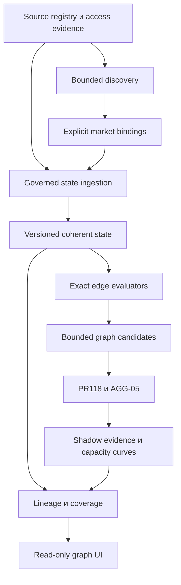

# Целевая архитектура

Цель: единая наблюдаемая карта рынков, финансовых прав и допустимых преобразований. На ней можно находить кандидатов и объяснять, какие inputs/state/costs нужны для точного расчёта. Единая визуализация не означает единое атомарное исполнение всех chain и CEX.

## Четыре проекции с разными полномочиями

| Проекция | Содержание | Что не следует из её наличия |
| --- | --- | --- |
| Catalog/discovery | Domain, market addresses, instrument metadata, source receipts | Нет depth, guarantee или verified subscription |
| Local market state | Accounts/books, revisions, watermark, completeness, decoder proof | Не любой state пригоден для любой суммы или модели |
| Exact decision graph | Amount-specific conversion evidence и bounded candidates | Не доказано исполнение в будущем; нет разрешения live |
| Financial claims/research | Rights, deadlines, multi-input/output transformations, asynchronous obligations | Не все связи являются spot swap или атомарным маршрутом |

Реализовать проекции поверх найденных owners. Новый «универсальный» класс не должен заменить одновременно market observations, routing route graph, PR118 ledger и claims IR.

## Контракты, подлежащие согласованию

**Instrument identity:** settlement domain, chain/genesis, mint/address/object, token standard/revision и decimals; для прав — issuer, maturity, multiplier и rights hash. Symbol — только подпись. Native/wrapped, bridged assets и claims связываются проверенными conversion edges, не равенством названий.

**Market identity:** domain + program/contract + market/pool; providers указываются как источники evidence, а не новые reserves. Opposite directions одного pool делят физическое состояние.

**State reference:** source/partition, slot/block hash/commitment, generation, complete account set, decoder/token revisions, observed/event/available time, payload hashes. Статусы missing/stale/gap/reorg не заменяются нулями.

**Edge evaluation:** requested amount, consumed input, residual balances, output asset/amount, expected и conservative output раздельно, fees by asset, validity conditions, state before/after, resource footprint и rejection reason. Если guaranteed output неизвестен, текущий exact graph не получает положительное evidence автоматически.

**Capacity point:** одна конкретная integer input amount + ordered leg evidence + gross result + obligations/cost ledger + conservative net + data/compute budget + status. Набор points — sampled curve. Линия между ними допустима только как визуальная подсказка и не создаёт исполнимых amounts.

**Transformation:** vector inputs/outputs, rights consumed/created, obligations, domain, time window, conditions, state mutation. Hyperedge не расщеплять на независимые бесплатные outputs. Async request/claim не является spot conversion.

## Amount coupling

Новый размер пересчитывает все legs. Текущую семантику guaranteed-output coupling PR559 сохранить. Не вычислять output нового размера через отношение input к сохранённому quote. Constant-product, stable, ticks/bins и orderbook lots используют свои закреплённые integer rules.

PR118 выбирает из bounded точек без предположения о монотонности. AGG-05 может делать marginal shortlist, но не подтверждать прибыль через multiplier. Exact evaluation связывает amount, state, costs и resources. Заявление об оптимуме ограничивается объявленным конечным множеством allocations/orders/points; оно не относится ко всему непрерывному рынку.

## Общий mutable state

Для split ветви последовательно получают next_state предыдущей ветви. Нельзя дважды использовать reserves, одну book depth, collateral или financing capacity. Replay order входит в evidence. Общие расходы отличаются от per-leg/per-path расходов. Начальное immutable состояние не мутирует между альтернативами.

## Согласованность и непрерывность

Complete означает complete для заданного fanout и account universe на выбранной policy, не «всё Web3». Missing accounts/slot spread/future timestamps/expired evidence дают отказ. Cursor checkpoint хранить вместе с proof восстановления snapshot; курсор сам по себе не восстанавливает state.

Continuous engine строится через ограниченные windows, durable state snapshots, backfill и targeted invalidation. Не превращать bounded PR561 ingest в бесконечный collector снятием лимита512. Domain finality отличается: Solana slot, EVM block hash и exchange sequence не сводятся к одному числу времени.

## Пример экономики в одной единице расчёта

При input100, conservative output105, repayment101 и других ещё не учтённых расходах2 net=2. Если swap fee уже входит в output, повторно её не вычитать. Principal уже входит в repayment. Любой cost в другом asset требует доказанного valuation/settlement правила существующего owner; неизвестные расходы не считаются нулевыми.

На начальном этапе только SOL/WSOL settlement через PR118. Расширение multiasset economics — отдельное изменение канонического owner, без подмены atoms/lamports. Все financing расчёты здесь — модели и evidence, без borrow или transaction submission.
