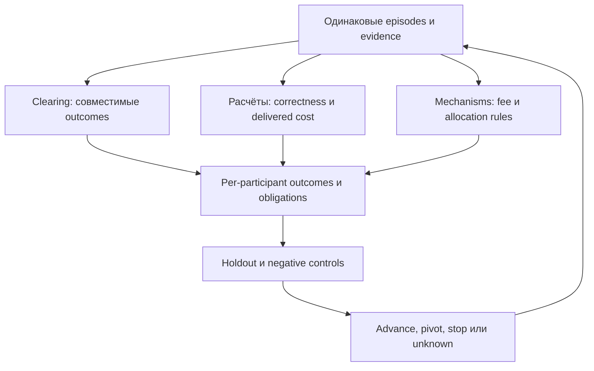

# Следующий R&D для всех трёх направлений

**Следующий результат — общий воспроизводимый стенд и три проверяемых продуктовых гипотезы.** Это расширение WG-25/26/27 прежнего плана. Исследования пока не выполнены; код, новые PR, subscriptions и deployments не создавались. Архив содержит задания на потом.

## Три направления и первый эксперимент

| Направление | Что проверить первым | Что измерить | Что строить при успехе |
| --- | --- | --- | --- |
| Clearing solver | Совместить встречные intents и направить только остатки во внешние pools | Per-user outcome, swaps, net costs, peak funding по каждому asset | Ограниченный batch solver; затем wrappers/claims и split-flow |
| Проверяемые расчёты | Заменить sum-int-v1 одним exact quote service в существующем INST-01 | Correctness, полная стоимость с verification, deadline и replay | Evidence API; marketplace только если procurement лучше local service и есть спрос |
| Mechanism lab | Fixed fee против одного dynamic-fee rule на pinned v4 model | Trader cost/fill, LP итог, solver net, resources, sensitivity | Один проверенный rule/product dossier, затем allocation и custom accounting |

Приоритет реализации: **общий corpus → clearing + exact-service pilot → fee-mechanism pilot → совместный product experiment**. Полные три системы не нужно завершать до первого ответа на R&D-вопрос. Нет заранее заявленной доходности или преимущества.

## Общая петля исследований

Это общий формат evidence и сравнений, не единый atomic snapshot всех chain. Solana fixtures и EVM/v4 fixtures остаются отдельными domains. Методика связывает три продукта: clearing создаёт задачи расчёта; сервис поставляет проверяемые результаты; лаборатория меняет одно правило и проверяет последствия для всех участников.

## 1. Clearing: сначала сэкономить реальные операции

В CoW есть solver competition и выбор комбинаций bids с ограничениями fairness; это полезный внешний пример, но не готовая интеграция в Studious. Наш исследовательский вопрос уже: можно ли выполнить тот же набор требований лучше на нашем declared universe?

Сравнить A independent execution, B netting+residual routing, C B+одна immediate transformation. Independent execution тоже должно последовательно менять shared pool state. Сравнение с несколькими независимыми нетронутыми snapshots даёт ложную экономию. При разном fill size не смешивать saved costs и skipped orders.

Не сводить цель к сумме surplus. Сначала feasibility: ограничения каждого пользователя, asset conservation, ownership/rights и obligation closure. Затем выбирать declared cost/surplus goal и измерять funding отдельно. Уменьшение числа swaps не всегда уменьшает peak capital.

Для фиксированного расписания без deferred credit дополнительное prefunding по активу a:

`F_a = max(0, -min_t(B_a,0 + Σ(k≤t) Δ_a,k))`.

B — только доступный разрешённый баланс; Δ — действительные cashflows, не желаемые будущие quotes. Формула описывает fixed schedule. Fee зависит от loan size, поэтому полный financing recipe пересчитывается. При protocol transient window проверяются его собственные capacity и closing boundary; отрицательные промежуточные deltas не разрешены произвольно. Скалярный existing prefix owner нужно расширять строго по asset units, не суммировать USDC с SOL.

## 2. Вычисления: сначала проверить экономику verification

Existing INST-01 умеет procurement и semantic verification для узкой услуги sum-int-v1. Нужен один полезный service kind с pinned state и exact expected result. Затем можно отдельно сравнивать decoding, fixed-route evaluation и route search.

Четыре различных утверждения: результат корректен для входа; вход аутентичен; вход достаточно свеж; результат оптимален в объявленном пространстве. Hash доказывает привязку bytes, не все четыре утверждения. Exact replay выбранного маршрута не доказывает, что лучше маршрута не было.

Измерять всю цепочку preparation→queue→transfer→compute→verification→retry. Быстрый внешний ответ теряет смысл, если его независимая проверка дороже локального расчёта. Поэтому самый простой exact quote может оказаться хорошим correctness benchmark, но плохим товаром; это полноценный R&D-результат, не неудача проекта.

Первая бизнес-гипотеза — evidence/replay API для конкретного клиента. Token, staking/slashing и ZK marketplace добавлять только после доказательства нужного trust/cost bottleneck. Synthetic buyer utility не доказывает willingness to pay. Реальный спрос, retention без subsidies и contribution margin сейчас UNKNOWN; в пакете только дизайн будущего исследования.

## 3. Mechanisms: улучшение для кого?

Uniswap v4 hooks позволяют менять поведение пула на определённых lifecycle points; dynamic LP fee может задаваться на отдельных swaps. Hook входит в PoolKey и не заменяется у уже созданного пула. Поэтому experiment identity должна включать hook/configuration, а новый rule variant не притворяться тем же неизменным рынком.

Первое сравнение: fixed fee против одной bounded dynamic rule. Не начинать сразу с новой exchange или chain. Записать trader costs/fills, LP fees и inventory outcome, solver result и gas/compute. Рост LP fees может быть переводом денег от trader, а не ростом общей полезности. Сокращение arbitrage для LP и рост прибыли arbitrage-bot могут противоречить друг другу: это разные целевые функции.

Исторический replay при фиксированном order flow — условный counterfactual. Новые fees могут менять flow и liquidity, поэтому в следующем этапе нужны sensitivity/agent-response scenarios. Такое моделирование само по себе не даёт причинного доказательства реального спроса.

Далее: правила batch allocation, затем один custom-accounting/wrapper продукт. Flash accounting может уменьшать промежуточные transfers, но требует закрытых deltas; оно не отменяет обязательства и не финансирует ожидание bridge/maturity. Hook existence не гарантирует liquidity или distribution.

## Критерии решения

1. Correctness: ноль известных нарушений обязательных invariants на закреплённых cases. Это ограниченное подтверждение, не universal proof.
2. Engineering: воспроизводимость, полная стоимость, latency/resource bounds и honest unknown/gaps.
3. Economic hypothesis: сравнимый benefit после costs на held-out episodes, без скрытого ухудшения запрещённых per-user outcomes.
4. Product hypothesis: отдельно измеренный спрос без subsidies. До этого говорить research/internal tool, не profitable marketplace.

Фиксированных процентов прибыли или «30% быстрее» здесь нет. Minimum worthwhile improvement, latency ceiling и acceptable uncertainty задаются до оценки и зависят от выбранного клиента/workload. Маленький corpus не выдаётся за достаточную статистическую мощность.

Ни один результат исследования не включает trading/live authority. Все дальнейшие steps сохраняют disabled OrderbookAmmStrategy и исключают sender/signer/submission/deployment.

## Следующие карточки

| ID | Эксперимент | Зависимости | Карточка |
| --- | --- | --- | --- |
| RD-00 | Общий корпус и проверяемый benchmark | — | [Открыть](rnd_three/RD-00.md) |
| CLR-01 | Clearing против отдельных обменов | RD-00 | [Открыть](rnd_three/CLR-01.md) |
| CLR-02 | Минимальное необходимое финансирование | CLR-01 | [Открыть](rnd_three/CLR-02.md) |
| CLR-03 | Преобразования прав поверх clearing | CLR-02 | [Открыть](rnd_three/CLR-03.md) |
| VRC-01 | Первая полезная проверяемая услуга | RD-00 | [Открыть](rnd_three/VRC-01.md) |
| VRC-02 | Конкуренция поставщиков с полной ценой проверки | VRC-01 | [Открыть](rnd_three/VRC-02.md) |
| VRC-03 | Какие расчёты выгодно проверять и покупать | VRC-02 | [Открыть](rnd_three/VRC-03.md) |
| MML-01 | Dynamic fee против фиксированной комиссии | RD-00 | [Открыть](rnd_three/MML-01.md) |
| MML-02 | Правила batch auction и allocation | CLR-01, MML-01 | [Открыть](rnd_three/MML-02.md) |
| MML-03 | Custom accounting и будущие финансовые продукты | CLR-03, MML-02 | [Открыть](rnd_three/MML-03.md) |

## Уточнённые existing owners

| ID | Owner | Символы | Проверенное ограничение |
| --- | --- | --- | --- |
| R01 | src/research/benchmarks.py | BenchmarkMeasurement; ComparativeBenchmark; compare_measurements | Есть end-to-end preparation/transfer/queue/compute/verification/cost/memory metrics. Переиспользовать, не писать отдельную benchmark authority. |
| R02 | src/research/product.py | DataEvidenceApi; DataEvidenceArtifact | Rights/access/query-budget и metadata admission; hash не доказывает семантическую корректность произвольного расчёта. |
| R03 | src/research/pr359_wave15_institution.py | InstitutionRuntime; SemanticEvidenceResolver; allocate_service | INST-01 уже существует, service sum-int-v1. Следующий шаг — квалифицированный новый service kind, не новая auction platform. |
| R04 | src/mechanism_discovery/pr356_discovery.py | prove_program_prefix_feasibility; prove_program_obligation_closure | Есть prefix/closure research primitives. Prefix helper сейчас scalar и использует int coercion; multiasset strict typed adapter/extension нуждается в проверке у этого owner. |
| R05 | src/mechanism_discovery/pr356_state_machine.py | DeferredConstraintWindow; snapshot_financial_graph_topology | Есть topology/deferred-window owner; временный долг допустим только в явно заданном протоколом окне, не везде. |
| R06 | src/mechanism_discovery/pr356_state_completion.py | define_clearing_invoice; reconstruct_netting_queue; qualify_clearing_strategy | Функции оборачивают run_requirement; их имена не доказывают готовый clearing algorithm или реальные queue data. |
| R07 | src/mechanism_discovery/hook_native.py | attest_hook_runtime_identity; simulate_hook_fee_surface; qualify_hook_family | PR354 research contracts через make_research_function; нужна одна pinned v4 model/adapter с independent vectors. |
| R08 | src/mechanism_discovery/research_quality.py | purged_walk_forward_split; run_equal_budget_ablation; evaluate_null_control | Owner для holdout/ablation/null controls; acceptance thresholds предварительно фиксировать. |
| R09 | src/mechanism_discovery/causal_twin.py | define_market_intervention; reject_unsupported_causal_claim | Исследовательские causal-assumption contracts; counterfactual replay сам по себе не доказывает реакцию живого рынка. |

Основные PR118, AGG-05, market streams и claims owners остаются в01_CURRENT_STATE_AND_OWNERS_RU.md. Новые сведения — targeted inspection того же baseline main72ae95fd; это не новый полный аудит и не обновление remote main.

## Первичные источники, открытые 3 октября2026 по Риге

- [CoW Solvers](https://docs.cow.fi/cow-protocol/concepts/introduction/solvers).
- [CoW Fair Combinatorial Auction](https://docs.cow.fi/cow-protocol/concepts/introduction/fair-combinatorial-auction).
- [Uniswap v4 Hooks](https://developers.uniswap.org/docs/protocols/v4/concepts/hooks).
- [Uniswap v4 Dynamic Fees](https://developers.uniswap.org/docs/protocols/v4/concepts/dynamic-fees).
- [Uniswap v4 Flash Accounting](https://developers.uniswap.org/docs/protocols/v4/concepts/flash-accounting).

Отдельный URL concepts/custom-accounting через механизм чтения оказался недоступен; его содержимое не цитируется. Возможность custom accounting подтверждается страницей Hooks. Эксперименты, pilot caps, метрики и порядок работ — наши инженерные предложения, не claims протоколов.
