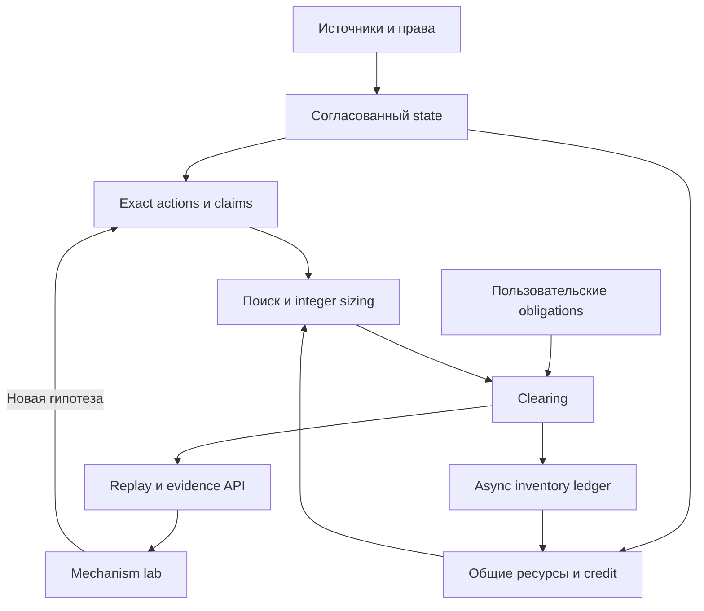

# Композиция: граф рынков, действий и общих ресурсов

**Предлагается одна модель доказательств поверх существующих owners.** UniversalArbitrageGraph остаётся bounded графом конкретных amount observations; richer claims/recipes и dependency index расширяют систему через нынешних владельцев. Новый универсальный solver рядом с PR118/AGG05 не нужен.

## Связь слоёв

В диаграмме нет пути к sender. Evidence providers обслуживают state decoding и exact evaluation под тем же контрактом задачи, а не заменяют source truth.

| Слой | Роль | Существующие owners |
| --- | --- | --- |
| DATA | Discovery and provenance | `src/market/source_catalog.py`, `src/market/discovery.py`, `src/market_data_evolution/contracts.py` |
| STATE | Coherent market state | `src/market/streams.py`, `src/strategy/market_graph_ingest.py` |
| ACTION | Exact transformation models | `src/strategy/exact_cpmm_capacity.py`, `src/direct_venue/cpmm_math.py`, `src/mechanism_discovery/claims.py` |
| RESOURCE | Rights, credit, aliases | `src/lending/financing.py`, `src/mechanism_discovery/pr356_state_machine.py`, `src/research/pr356_allocation.py` |
| SOLVE | Bounded search and sizing | `src/strategy/arbitrage_graph.py`, `src/strategy/multihop_solver.py`, `src/economics/non_monotonic_sizing.py`, `src/economics/split_flow.py` |
| CLEAR | User obligations and allocation | `src/mechanism_discovery/intent_graph.py`, `src/routing/route_graph.py` |
| EVIDENCE | Replay and verification service | `src/research/product.py`, `src/research/benchmarks.py`, `src/research/pr359_wave15_institution.py` |
| LAB | Mechanisms and competitive response | `src/mechanism_discovery/causal_twin.py`, `src/research/pr356_ecology.py` |
| RECONCILE | Non-atomic lifecycle | `src/inventory/non_atomic.py`, `src/inventory/research.py` |

## Три разных графа с явным отображением identities

1. **Каталог** хранит discovery metadata и blocked/watchlist records. Он может быть большим, но его размер не является coverage исполнимых возможностей.
2. **Активный exact graph** содержит только согласованные наблюдения нужного domain, amount, model и generation. В нём остаются детерминированные bounds и запрет повторов venue для circular detector.
3. **Граф зависимостей и recipe constraints** связывает действия с общими reserves, allowances, collateral, hooks, oracle и settlement obligations. Hyperedge для split/merge имеет несколько активов на входе/выходе; это не две бесплатные независимые стрелки.

Stable asset identity включает domain/genesis, contract или mint/object type, token semantics и decimals. Для financial claim дополнительно важны issuer/controller, underlying/index, maturity, exercise/settlement rules и eligibility. Изменяющиеся balances и available_at — state/evidence, а не произвольно изменяемая семантическая identity.

Сохранить два ID: semantic route/recipe для сравнения одной экономической операции и evidence evaluation ID для конкретной суммы/state/порядка/версии модели. Смена provider delivery metadata не обязана менять semantic ID, но смена экономических условий должна менять соответствующий evidence. Existing route_graph hash и PR559 route identity имеют разные задачи.

## Условия, при которых layers действительно соединяются

| Проверка | Требование | Контрпример |
| --- | --- | --- |
| Domain и время | Объявленная atomic boundary или отдельная async lifecycle | ETH на двух chains не один доступный balance |
| Amount units | Integer atoms каждого input/output; requested=consumed+residual | USDC atoms переданы в lamports поле |
| State coherence | Все dependencies известны на declared watermark/commitment | Hook fee обновлён, reserve cache прежний |
| Liquidity alias | Общий ресурс расходуется один раз и немедленно меняет state | Два routes из разных агрегаторов используют один pool |
| Rights | Eligibility, controller и доступ к conversion/order доказаны | Видимый order доступен только exclusive filler |
| Prefix checks | Все обязательные промежуточные проверки проходят | Финал solvent, но ранний collateral transfer запрещён |
| Closure | Долги, transient deltas и остатки учтены по каждому asset | Положительный output при незакрытом обязательстве в другом token |
| Model qualification | Revision закреплена и проверена независимо | Строка decoder-v1 принята за proof |

## Exact evaluation contract — проект расширения

Вход: typed input vector, immutable state capsule, account/rights context и finite work budget. Выход: consumed/residual/output vector, embedded fees, before/after state IDs, read/write dependencies, obligations, eligibility/rejection reason и completeness.

Обязательное равенство для каждого актива: starting balance + admitted inflows − consumed outflows − due obligations = ending available balance, с отдельным учётом held claims. Нельзя складывать разные assets без явно закреплённого conversion/valuation evidence.

`output = f(amount, state, rights, context)` — точный результат только для квалифицированной модели и указанной суммы. Для hooks, credit и split-flow это state transition, а не pure price multiplier. Conservative bound требует обоснования; название поля conservative не доказывает гарантию будущего исполнения.

## Общая ликвидность и порядок

Два virtual allocations по80 при реальном balance100 не создают160 капитала. Если первая операция расходует70 и не возвращает этот asset, второй остаётся30. Если первая возвращает капитал, совместная ёмкость зависит от допустимого порядка и checks. Нельзя свести все такие случаи к независимым capacity curves.

Внутри выбранного joint evaluation: переход первого path применяется перед вторым, состояния остальных зависимых рынков инвалидируются или пересчитываются. Каждая permutation имеет отдельный evidence ID. Для неизвестного взаимодействия — reject, не assumption независимости.

Не ослаблять запрет repeated venue у PR559 ради credit/claims. Эти операции требуют отдельного typed recipe constraint на существующих claims/primary-market owners и доказанных границ, тогда как исходные 3/4-hop circular candidates сохраняют прежние инварианты.

## L1/L2/L3 и где строить продукт

Начать с приложения/evidence API поверх существующей сети. Собственная L2/L3 становится отдельной гипотезой только после измеренного спроса и конкретного дефицита: ordering, shared execution, latency, fee predictability или нужные contract primitives. Собственная L1 оправдывается потребностью менять consensus/settlement, которую нельзя удовлетворить в текущем стеке.

В future comparison считать всю стоимость: DA/settlement, sequencer, RPC/indexing, recovery, bridge/inventory и migration клиентов. Новая сеть не устраняет отсутствие order flow, collateral и квалифицированных моделей. Граф Web3 может объединять наблюдения разных domains для анализа, но это не одна atomic transaction boundary.
