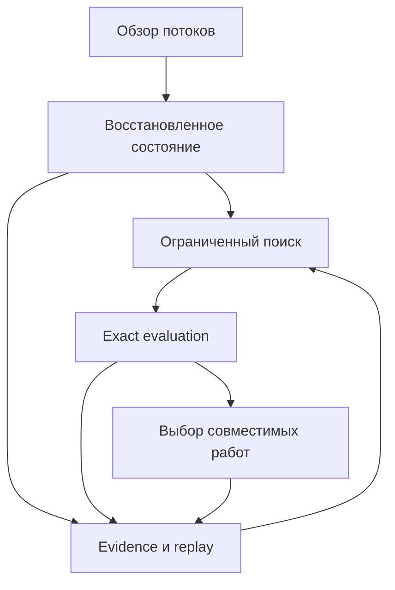

# Большой Market-of-Markets: расширение единого плана

Обновление от 2026-10-03. Цель — наблюдать широкий рынок, быстро проверять ограниченное множество перспективных преобразований и распределять работу по реальным независимым ресурсам. Размер архива и количество workers сами по себе не создают прибыль.

Это единый пакет будущих работ поверх предыдущего R&D. Здесь 28 новых карточек возможностей, 16 связанных этапов, 8 экспериментальных дизайнов и 64 дополнительных acceptance scenarios. Ни один из этих экспериментов не запущен. Новые исходные данные — прочитанная документация и dashboard snapshots, а не подключённые торговые feeds.

## Что уже существует

Fetched `main` остаётся `67d3852cbc4cb1b24582df45adbf6a42d4da2af0`. PR559 graph, PR118 sizing, AGG05 split-flow и conflict scheduler, provider governance и durable lifecycle — существующие владельцы. PR562 добавил exact CPMM bridge; первый необходимый шаг остаётся DP-01 qualification, затем DP-02 совместного состояния двух путей.

При чтении найдено важное ограничение масштаба: `DurableLifecycleStore` поддерживает single-node SQLite; `ConflictAwareScheduler` хранит active work в памяти процесса. Это полезные foundations, но не доказательство готового распределённого торгового runtime. Полная карта и границы — в [35_CURRENT_OWNERS_AND_LIMITS_RU.md](35_CURRENT_OWNERS_AND_LIMITS_RU.md).

## Как собрать систему

| Контур | Что делает | Как масштабируется | Что ограничивает |
| --- | --- | --- | --- |
| Обзор потоков | Ранжирует рынки по обороту, капиталу, fees и качеству данных | Редкие batch-запросы, общие каталоги | Definitions, coverage, права и квоты |
| Состояние | Восстанавливает конкретные пулы, книги и lending reserves | Партиции, один writer на состояние, общий raw log | Порядок, gaps, forks и стоимость данных |
| Поиск | Обновляет только затронутые отношения и маршруты | Независимые immutable jobs | Размер окрестности, freshness и конечные bounds |
| Exact evaluation | Пересчитывает выбранные amounts и совместное состояние | CPU processes, кеш с полной identity | Математика продукта, integer rounding, snapshot validity |
| Выбор портфеля | Выбирает совместимый набор с учётом всех ресурсов | Компоненты conflict graph, bounded solver | Общие pools, lender cash, payer, margin, compute |
| Lifecycle | Резервирует и завершает работу с fencing | Сначала одна authority, позже проверенные границы шардов | Crash recovery, double spend, unknown outcomes |
| Продукты | Clearing, проверяемые расчёты, mechanism lab, позже MM | Общие evidence contracts и реальный спрос | Доступ к потоку, качество и unit economics |

## Приоритет

1. Квалифицировать уже существующие integer semantics и exact state. Иначе больше workers лишь быстрее производят неверные выводы.
2. На одном домене доказать восстановление данных и ограниченный параллельный replay. Измерять стоимость полезного результата и устаревание.
3. Добавить joint two-path sizing и корректный read/write/economic conflict graph. Flashloan capacity проверять в том же состоянии, что и route.
4. Расширять круг рынков по измеренному after-cost результату и качеству доступа. Correlation discovery может давать идеи, но не исполнимые гарантии.
5. Развивать market making и клиентские solver products через отдельные модели inventory, доступа и спроса.

## Навигация

- [Крупные потоки и что они означают](24_MONEY_FLOWS_AND_PRIORITIES_RU.md).
- [28 классов возможностей](25_OPPORTUNITY_ATLAS_RU.md).
- [Data federation, книги и восстановление](26_DATA_FEDERATION_AND_RECOVERY_RU.md).
- [Корреляции и новые отношения](27_CORRELATION_DISCOVERY_RU.md).
- [Параллельный расчёт и будущая координация исполнения](28_PARALLELISM_AND_RESOURCE_SCHEDULING_RU.md).
- [Финансирование, debt closure и capacity](29_FLASHLOAN_FUNDING_AND_CAPACITY_RU.md).
- [Market makers и три продукта](30_MARKET_MAKING_AND_PRODUCTS_RU.md).
- [Стоимость, throughput и наблюдаемость](31_SCALE_BUDGETS_AND_OBSERVABILITY_RU.md).
- [Этапы](32_PARALLEL_WORK_PACKAGES_RU.md), [приёмка](33_PARALLEL_ACCEPTANCE_RU.md), [handoff](34_PARALLEL_SCALE_HANDOFF_RU.txt).

План сохраняет shadow-only границу. Он не включает новую реализацию sender, signer, submission, live authorization или включение OrderbookAmmStrategy.
