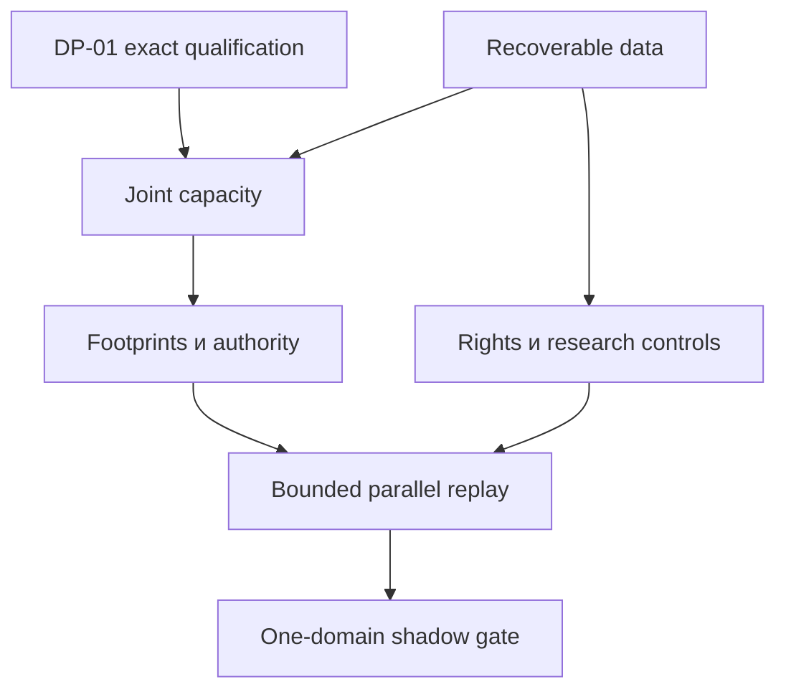

# Этапы реализации большого market graph

Все PM — локальные номера work packages, не GitHub PR. Результат пакета — существующий единый ZIP для будущей реализации. Реализовывать последовательно bounded slices с повторной проверкой актуального main; не создавать один огромный PR на все этапы.

| ID | Работа | Зависимости | Результат / gate |
| --- | --- | --- | --- |
| PM-01 | Qualification before scale | — | Revision-bound canonical assets, independent CPMM vectors and amount-local rejection report; DP-01 gate passes without weakening integer amounts or repeated-venue constraints |
| PM-02 | Money-flow observatory | — | Point-in-time stock/flow metrics, coverage and source revisions; Reconciles routed-flow double counts and never reports TVL as flash cash |
| PM-03 | Source entitlements and budgets | PM-02 | Per-endpoint rights, physical request accounting, retry and storage budgets; All jobs have valid limits; unknown rights or missing budgets block affected jobs |
| PM-04 | Recoverable state reconstruction | PM-03 | One bounded feed domain with raw log, snapshot, gap repair and retractions; Deterministic replay hash after disconnect/reorg/crash; no candidates from invalid partitions |
| PM-05 | Typed economic relation registry | PM-02 | Exact payoff versus empirical relations with access and time predicates; Ticker aliases, delayed claims and inaccessible redemption remain separate |
| PM-06 | Incremental candidate work | PM-01, PM-04, PM-05 | Affected-neighborhood invalidation and deterministic bounded work keys; Same candidate/evidence IDs at 1/2/4 workers and after event permutation within allowed ordering |
| PM-07 | Joint exact capacity | PM-01, PM-06 | Two paths, finite integer grid, shared-state replay in both orders; No double use of liquidity; compare with same-budget best single path |
| PM-08 | Complete conflict footprints | PM-06 | Proposed access-mode map plus lender/payer/nonce/order/margin resource identities; Read/write conflicts caught; read/read allowed; unknown accounts reject |
| PM-09 | Single authority and fenced work | PM-08 | One selected lifecycle path, ReservationPort bridge and installed-path evidence; Two processes cannot both reserve same work; restart and stale fence preserve holds |
| PM-10 | Parallel compute and backpressure | PM-04, PM-06, PM-09 | Bounded CPU process workers over immutable frames; leased jobs and stale output rejection; Determinism and zero stale admission at 1/2/4/8 workers; cost/tail latency reported |
| PM-11 | Resource portfolio allocation | PM-07, PM-08, PM-09 | Finite conflict components, explicit complete budgets and same-unit net-score objectives; Brute-force small fixtures agree; common dependencies and capital dimensions never omitted |
| PM-12 | Lender terms and debt closure | PM-01, PM-04, PM-08 | One lender/asset revision with capacity, premium, instruction/callback terms; Each asset repays principal plus fees; native cost reserves remain independent |
| PM-13 | Correlation research controls | PM-04, PM-05 | Registered hypotheses, point-in-time features and purged chronological holdout; Latency/null controls and multiple-test accounting; economic-cost test separate |
| PM-14 | Market-making replay | PM-04, PM-05, PM-13 | One venue replay with conservative queue, cancel delay, hedge and markout accounting; All fills and inventory persist; no flashloan-funded resting inventory |
| PM-15 | Three-product bridge | PM-07, PM-13 | Clearing/evidence-service/mechanism-lab share data and evidence contracts; Per-user clearing limits, independently verified results and strategic-response sensitivity |
| PM-16 | One new domain and forward-shadow gate | PM-10, PM-11, PM-12, PM-13 | One chosen chain/venue dossier, measured replay-to-shadow evaluation and stop conditions; Qualified coverage/cost gate with no live promotion; all missing observations explicit |

## Связь с предыдущими планами

PM-01 является зависимостью на DP-01, PM-07 — на DP-02. Они не создают дублирующие solver implementations. WG-02/06/07/10/11 остаются частично представленными PR562 с оставшимся planned scope. CLR/VRC/MML, SCALE и DP experiments сохранены в архиве с исходными статусами.

Сначала DP-01: canonical identity/deployed revision boundary, source-independent CPMM integer vectors и per-amount rejection. Первый PR по параллелизму после qualification — PM-08: read/write/economic footprint extension в AGG05 с offline deterministic fixtures, без distributed runtime и без включения trading. Следом PM-09 single-authority bridge, затем PM-10 bounded worker study.

## Параллельная инженерная работа

Независимые ветви R&D могут изучать flow metrics, rights и provider cost contracts при одном frozen baseline. Изменения общего graph/sizing/state/authority владельца интегрируются по зависимости; нельзя параллельно создать несколько источников истины. Эта диаграмма описывает будущий project workflow, не запущенные агенты.

## Эксперименты

| ID | Дизайн | Корпус | Метрики / gate |
| --- | --- | --- | --- |
| PS-01 | Data coverage and repair | One venue, bounded recorded outage/reorg traces | Replay state hash, gap downtime, bytes and request cost; No candidate while state is invalid |
| PS-02 | Compute scaling | Identical corpus at 1/2/4/8 process workers | Useful candidates before deadline per CPU-second; p50/p95/p99 age; Identical decisions and bounded queues; improvement must exceed overhead |
| PS-03 | Conflict-aware selection | Disjoint pools, shared lender, shared payer, read/write and read/read | Foregone modeled surplus, component sizes and admitted set correctness; Agreement with exhaustive small cases; measure heuristic gap for large components |
| PS-04 | Joint two-path capacity | Exact grid, path ordering, changed lender fees and partial fill rejections | Net benefit over best single path at equal total compute cost; Debt closure and shared-state consistency for every selected point |
| PS-05 | Correlation falsification | Registered pairs, asynchronous timestamps and null/lag perturbations | Out-of-sample residuals, effective episodes, after-cost economics; Unknown remains unknown; no promoted relation from in-sample correlation |
| PS-06 | Market-maker economics | One book and conservative queue/cancel/hedge variants | Fill-conditioned markouts, inventory drawdown and total PnL; Full cost and loss accounting; no invented trade access |
| PS-07 | Useful service procurement | Same decoding/routing problem and independent validator | Useful correct output cost, latency, error and repeat demand design; Do not count signed incorrect output or subsidized self-demand |
| PS-08 | Forward-shadow readiness | Recorded replay first; future read-only capture under a bounded explicit run budget | Useful coverage, invalidations, failure recovery and economic uncertainty; No live enablement; promotion is separate future scope |

Ни один эксперимент PS не выполнен. Время реализации зависит от качества raw state, decoder и access; даты сдачи и бюджет покупок не выдумываются. У каждого bounded PR нужны конкретный owner, scope, measured corpus и отрицательные тесты. После gate не добавлять лишние проверки без конкретного риска.
